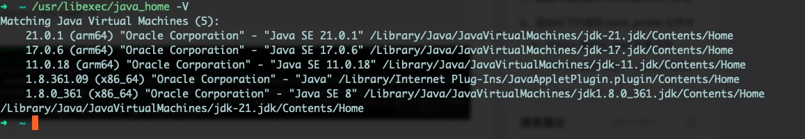
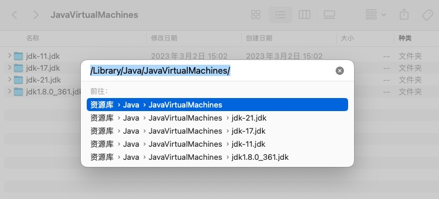
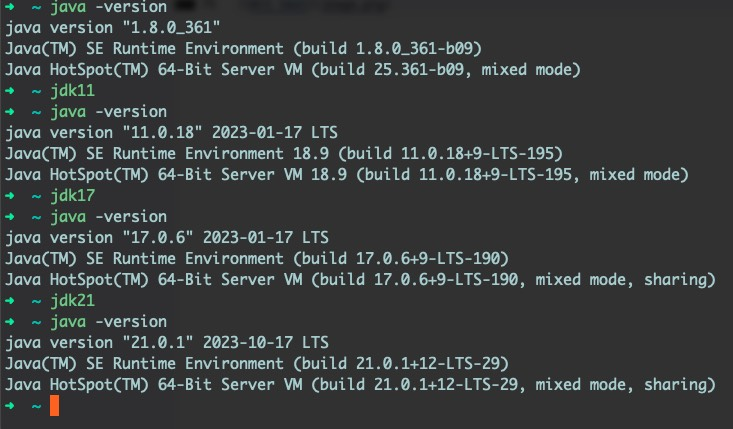

# MacOS管理多版本JDK

## ✨ 从官网选择下载你需要的 JDK 版本
👉🏻 https://www.oracle.com/java/technologies/downloads/

下载完成后 直接安装完成即可。

## 🌟 检查已安装 JDK 的版本及路径
- 使用命令可以查看本机上 安装过的 `JDK`
``` bash
/usr/libexec/java_home -V
```


- 也可以通过 `Finder` 来转至其安装目录

使用快捷键 `Command + Shift + G` 来前往文件夹



## 🚀 配置环境变量

- 打开你正在使用的 `shell配置文件`，我这里使用的是 `.zshrc`
``` bash
vim ~/.zshrc # 推荐 使用 vim
# or
open ~/.zshrc
```

- 在配置文件中 合适的位置 添加如下配置
``` bash
# java
# 一定先把JAVA_HOME 清空
unset JAVA_HOME

# 设置已经安装的版本
export JAVA_8_HOME=$(/usr/libexec/java_home -v1.8)
export JAVA_11_HOME=$(/usr/libexec/java_home -v11.0)
export JAVA_17_HOME=$(/usr/libexec/java_home -v17.0)
export JAVA_21_HOME=$(/usr/libexec/java_home -v21.0)

# 设置临时切换jdk版本命令
alias jdk8="export JAVA_HOME=$JAVA_8_HOME"
alias jdk11="export JAVA_HOME=$JAVA_11_HOME"
alias jdk17="export JAVA_HOME=$JAVA_17_HOME"
alias jdk21="export JAVA_HOME=$JAVA_21_HOME"

# 设置默认版本（这里就是以上 四选一）
export JAVA_HOME=$JAVA_21_HOME

# 把JAVA_HOME加入到path
export PATH=$PATH:$JAVA_HOME/bin:$JAVA_HOME/lib:$JAVA_HOME/jre/bin
```

::: info Tips
在 `shell配置文件` 中 如 上面的 `# 使用vim` 和 `# java`, 代表注释，这样你可以给你的 `shell文件` 添加说明了。
:::

#### 保存重新加载你的 shell配置文件
``` bash
# 重新加载
source ~/.zshrc
# 查看当前版本
java --version
```

## 🖥️ 设置本机环境中的 JDK 版本
- 这时就可以方便的使用设置的 `alias` 来进行版本切换


- 当然，也可以通过编辑 `shell配置文件`，保存后重新加载
``` bash
# 设置默认版本（这里就是以上 四选一）
export JAVA_HOME=$JAVA_21_HOME
```

::: info Tips
Vim: 上文中 提到 `vim ***` VIM 是 Linux 系统上一款文本编辑，使用起来也非常简单，可以自行搜索-下

本文使用 Vim 操作：
- 使用 Vim 打开 zshrc 文件：`vim ~/.zshrc`
- 打开后 输入 `i` 进入编辑（`Insert`）模式
- 结束后 使用 `ESC` 退出 编辑（`Insert`）模式
- 使用 `:wq` 保存文件并退出 Vim

退出相关操作：
- 保存文件但不退出 `:w`
- 强制保存文件但不退出 `:w!`
- 保存文件并退出 `:wq`
- 强制保存文件并退出 `:wq!`
- 不保存文件 退出 `:q`
- 不保存文件 强制退出 `:q!`

:::
