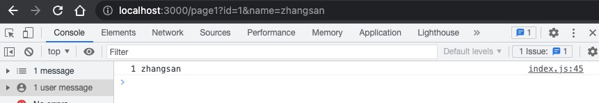
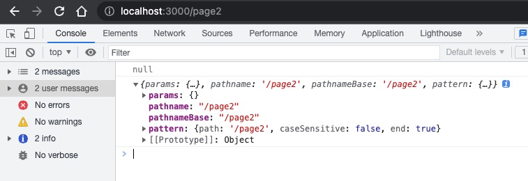
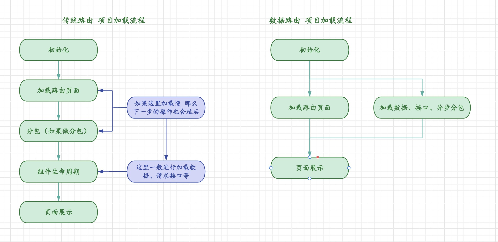

# 一杯咖啡的时间 上手React Router(V6.4)

> `V6.4` 是路由最激动人心的版本，它具有读取、写入和导航钩子的新数据抽象。可以轻松让 `UI` 与 数据保持同步。数据路由颠覆了传统模式，提高了性能。不再支持 `class` 类组件，全 `hooks` 支持。

## 🐸 初始化

- [create-react-app](https://github.com/facebook/create-react-app) 初始化项目
``` bash
npx create-react-app project-name
cd project-name
npm start
```

- [react-router](https://github.com/remix-run/react-router) 安装
``` bash
npm install react-router-dom
```

::: tip react-router 和 react-router-dom 的区别：

- 这是两个相关的库。`react-router-dom` 内部依赖于 `react-router` 。
- `react-router` 提供了 `router` 核心的 `API`。没有有提供有关 `dom` 操作进行路由跳转的 `API`。
- `react-router-dom` 提供了 `BrowserRouter`、`Route`、`Link` 等 `API`，可以通过 `dom` 操作触发事件控制路由

:::


::: tip 单页面和多页面的区别：

##### 单页面：
  - 在一个 `html` 中进行路由跳转，本质是通过 `js` 来控制的，适合 B端项目 ，不考虑 `SEO`。
  - 页面跳转不用刷新，用户体验更好，可以实现代码复用。
  - 缺点是 `SEO` 不友好。

##### 多页面：
  - 多页面实际上就是多个 `html`，通过 `window.location` 互相跳转。
  - `SEO` 友好，更适合 C端项目，每一个页面都可以是一个独立的项目，隔离性较好。
  - 缺点是每次跳转都要重新加载资源 刷新。体验和性能较差。

:::

## 🐸 路由组件

### 🐸 BrowserRouter

> 使用简洁的 URL 将当前位置存储在浏览器地址栏中，并使用浏览器内置的历史堆栈进行导航。

> `http://localhost:3000/page`

``` jsx {6,11-17}
import React from "react";
import ReactDOM from "react-dom/client";
import App from "./App";
import "./index.css";

import { BrowserRouter, Routes, Route } from "react-router-dom";

const root = ReactDOM.createRoot(document.getElementById("root"));

root.render(
  <BrowserRouter basename="/app">
    <Routes>
      <Route path="/" element={<Index />} />
      <Route path="pageA" element={<PageA />} />
      <Route path="pageB" element={<PageB />} />
    </Routes>
  </BrowserRouter>
);
```

::: tip basename
配置 `basename` 可以 使其在 `URL` 中的特定前缀下运行
:::

::: tip BrowserRouter 关于 404 的问题：
- 对于单页面的项目，服务器只需要提供 `index.html` 。
- 服务端可以使用 正则匹配或通配符来返回正确的资源。

:::

### 🐸 HashRouter

> `http://localhost:3000/#page`

> <HashRouter> 用于Web浏览器，当 URL 因某些原因不应（或不能）发送到服务器时。可以将当前位置存储在当前 URL 的 hash 部分，因此永远不会发送到服务器。

``` jsx {3,6-8}
import * as React from "react";
import * as ReactDOM from "react-dom";
import { HashRouter } from "react-router-dom";

ReactDOM.render(
  <HashRouter>
    {/* The rest of your app goes here */}
  </HashRouter>,
  root
);
```

- 不建议使用，改造服务端渲染很麻烦。

### 🐸 MemoryRouter

> 内存型路。将其位置存储在内部数组中。非常适合需要完全控制历史堆栈的情况。如用于单元测试。

``` jsx {3,8-14}
import * as React from "react";
import { create } from "react-test-renderer";
import { MemoryRouter, Routes, Route, } from "react-router-dom";

describe("My app", () => {
  it("renders correctly", () => {
    let renderer = create(
      <MemoryRouter initialEntries={["/users/mjackson"]}>
        <Routes>
          <Route path="users" element={<Users />}>
            <Route path=":id" element={<UserProfile />} />
          </Route>
        </Routes>
      </MemoryRouter>
    );

    expect(renderer.toJSON()).toMatchSnapshot();
  });
});
```

### 🐸 NativeRouter

> 是在 React Native 应用程序中运行 React Router 的推荐接口。

``` jsx {2,6-8}
import * as React from "react";
import { NativeRouter } from "react-router-native";

function App() {
  return (
    <NativeRouter>
      {/* The rest of your app goes here */}
    </NativeRouter>
  );
}
```

### 🐸 StaticRouter

> 静态路由。一般用于在 node 中渲染 React Router Web 应用程序。node 环境中没有 window 不能使用 BrowserRouter。

``` jsx {2,3,7-11}
import * as React from "react";
import * as ReactDOMServer from "react-dom/server";
import { StaticRouter } from "react-router-dom/server";
import http from "http";

function requestHandler(req, res) {
  let html = ReactDOMServer.renderToString(
    <StaticRouter location={req.url}>
      {/* The rest of your app goes here */}
    </StaticRouter>
  );

  res.write(html);
  res.end();
}

http.createServer(requestHandler).listen(3000);
```

### 🐸 Outlet 组件

> 父路由元素中应使用 <Outlet> 来呈现其子路由元素。这样就可以在呈现子路由时显示嵌套用户界面。如果父路由完全匹配，则会呈现子索引路由；如果没有索引路由，则不会呈现任何内容。子页面的占位符。

``` jsx {1,9,17-20}
import { BrowserRouter, Routes, Route, Outlet } from "react-router-dom";

const root = ReactDOM.createRoot(document.getElementById("root"));

function CommonHeader() {
  return (
    <div>
      <h1>This is common header</h1>
      <Outlet />
    </div>
  );
}

root.render(
  <BrowserRouter>
    <Routes>
      <Route path="/" element={<CommonHeader />}>
        <Route path="pageA" element={<PageA />} />
        <Route path="pageB" element={<PageB />} />
      </Route>
    </Routes>
  </BrowserRouter>
);
```


## 🐸 常用 Hooks

### 🐸 useNavigate

::: details 此钩子会返回一个函数，让您以编程方式导航。

- 第一个参数 `To` 值（与 `<Link to>` 相同）
- 第二个可选参数 `options?` 参数（与 `Link` 可以传递的属性类似）。
- 也可以在历史堆栈中传递对应值 `navigate(-1)`。

:::

``` jsx {2,6-8}
function CommonHeader() {
  const navigate = useNavigate();
  return (
    <div>
      <h1>This is common header</h1>
      <button onClick={() => navigate("/pageA?id=1&name=zhangsan")}>To PageA</button>
      <button onClick={() => navigate("/pageB", {state: { id: 1 , name: "zhangsan"}})}>To PageB</button>
      <button onClick={() => navigate(-1)}> Back</button>
      <Outlet />
    </div>
  );
}
```

### 🐸 useLocation

::: details 此钩子返回当前 location 对象。 可以获取一些 navigate 路由过来的状态。

:::

``` jsx
function PageB() {
  const location = useLocation();
  console.log(location);
  return <h2>This is PageB</h2>;
}
```


### 🐸 useSearchParams

::: details 此钩子用于读取和修改当前位置 URL 中的查询字符串。

- 返回一个包含两个值的数组：当前位置的搜索参数和一个可用于更新这些参数的函数。

:::

``` jsx {2,4,5,11-13}
function PageA() {
  const [searchParams, setSearchParams] = useSearchParams();

  const name = searchParams.get("name");
  const id = searchParams.get("id");
  console.log(id, name);

  return (
    <div>
      <h2>This is PageA</h2>
      <button onClick={() => setSearchParams({ id: 2, name: "lisi", age: 18 })}>
        change params
      </button>
    </div>
  );
}
```



### 🐸 useMatch

::: details 返回给定路径上的路由相对于当前位置的匹配数据

- 将路由路径模式与 URL 路径名进行匹配，并返回匹配信息。
- 当您需要手动运行路由器的匹配算法来确定路由路径是否匹配时，这个功能就非常有用。
- 如果模式与给定路径名不匹配，则返回null。

:::


``` jsx
const match1 = useMatch("/pageA");
const match2 = useMatch("/pageB");
console.log(match1);
console.log(match2);
```




## 🐸 数据路由架构

- 传统路由: 路由与 UI渲染之间的关系。
- 数据路由: 路由与 UI渲染和数据之间的关系，多了一个数据状态的抽象。



Router V6.4 解决的核心问题就是 可以实现并行加载资源，解决了单页面瀑布流的问题。

::: details Before: 假设 CommonHeader 组件渲染了两秒，PageA 中接口请求了两秒 那 username 的显示，至少大于四秒。

``` jsx title="App.js"
root.render(
  <BrowserRouter>
    <Routes>
      <Route path="/" element={<CommonHeader />}>
        <Route path="pageA" element={<PageA />} />
        <Route path="pageB" element={<PageB />} />
      </Route>
    </Routes>
  </BrowserRouter>
);
```

``` jsx title="PageA.js" {5-9,14}

function PageA() {
  const [userName, setUserName] = useState("");

  // 用户信息
  useEffect(() => {
    axios.get("/api/xxx").then((res) => {
      setUserName(res.data.userName);
    });
  }, []);

  return (
    <div>
      <h1>This is PageB</h1>
      <p>{userName}</p>
    </div>
  );
}
```

:::

::: details After: 假设 CommonHeader 组件渲染了两秒，PageA 接口请求了两秒，那么获取到的时间只接近于接口的时间。

``` jsx title="App.js 使用 createBrowserRouter" {1,2,7-10,17}
const router = createBrowserRouter(
  createRoutesFromElements(
    <Route path="/" element={<CommonHeader />}>
      <Route
        path="pageA"
        element={<PageA />}
        // 支持配置loader 使用返回值
        loader={async ({ request }) => {
          const res = await axios.get("/api/xxx");
          return res.data;
        }}
      />
      <Route path="pageB" element={<PageB />} />
    </Route>
  )
);

root.render(<RouterProvider router={router} />);
```


``` jsx title="pageA.js 使用 useLoaderData" {2}
function PageA() {
  const data = useLoaderData();
  return (
    <div>
      <h1>This is PageA</h1>
      <p>{data.userName}</p>
    </div>
  );
}

```

:::

::: tip 关于分包

> React.lazy 是 React 16.6 版本引入的一个特性，它可以让你以动态的方式进行代码拆分（code splitting）。通过 React.lazy，你可以延迟加载（lazy load）一个组件，只有在需要时才会加载该组件，从而提高应用程序的性能。

- Before: 依然假设 CommonHeader 组件渲染了两秒，PageA 做了分包，从至少两秒之后开始加载？
``` jsx title="开启分包" {1,6}
const PageA = React.lazy(() => import('./PageA'))

<Route path="/" element={<CommonHeader />}>
  <Route
    path="pageA"
    element={<PageA />}
    loader={async ({ request }) => {
      const res = await axios.get("/api/xxx");
      return res.data;
    }}
  />
  <Route path="pageB" element={<PageB />} />
</Route>
```

- After: 依然假设 CommonHeader 组件渲染了两秒，做了数据路由的 lazy，什么时候开始加载？
``` jsx title="数据路由的 加载分包" {8-13}
<Route path="/" element={<CommonHeader />}>
  <Route
    path="pageA"
    loader={async ({ request }) => {
      const res = await axios.get("/api/xxx");
      return res.data;
    }}
    lazy={async () => {
      const PageAModule = await import("./PageA");
      const PageA = PageAModule.default;
      return { element: <PageA /> };
    }}
  />
  <Route path="pageB" element={<PageB />} />
</Route>

```

:::


## 🐸 没有银弹

数据路由 带来了直观的性能提升。但是他的缺点是讲数据耦合到了 UI 中，增加了项目耦合性，维护成本提高。

然而世界上没有银弹。世界上没有完美的解决方案。

我们可以在性能没有问题的组件中使用传统模式。
对性能有要求可以考虑使用数据路由并行方式进行优化。

传统路由结合数据路由模式。