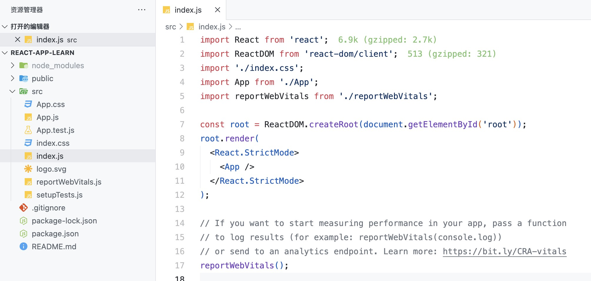
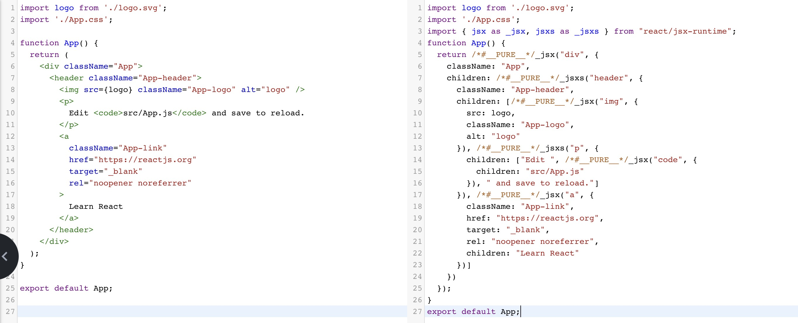
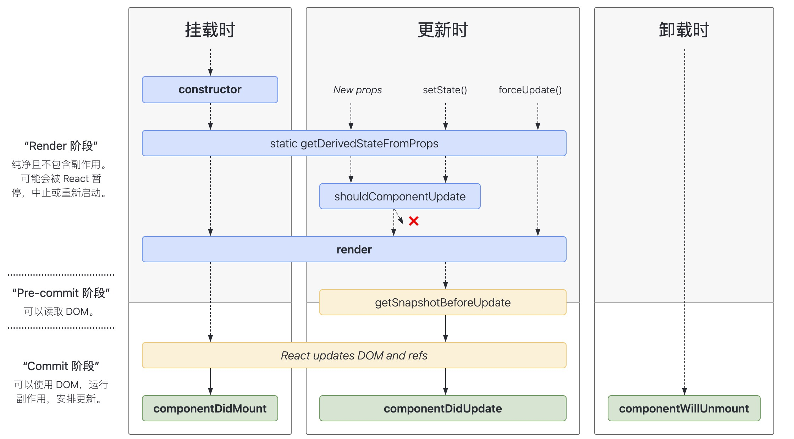
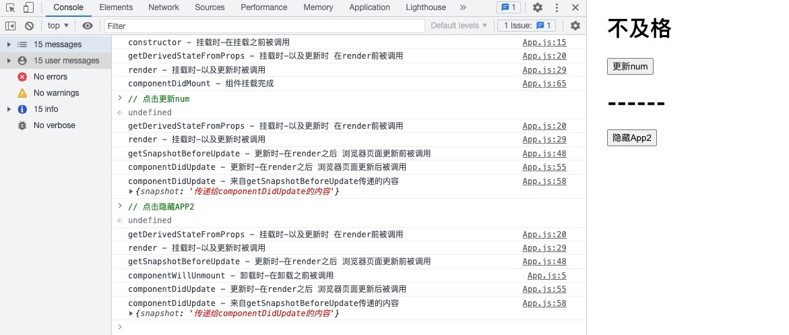
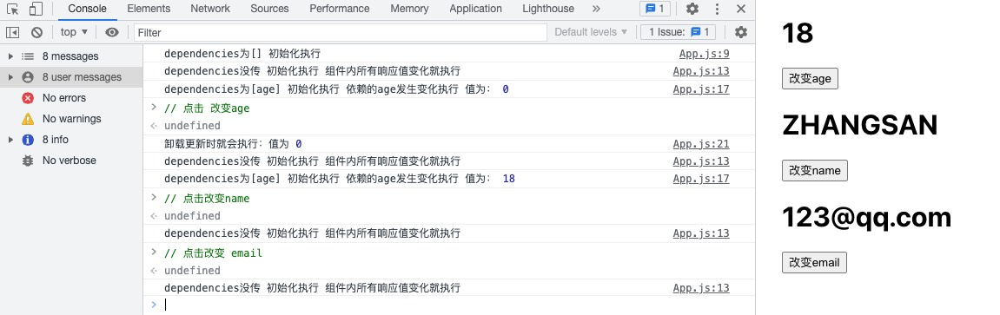
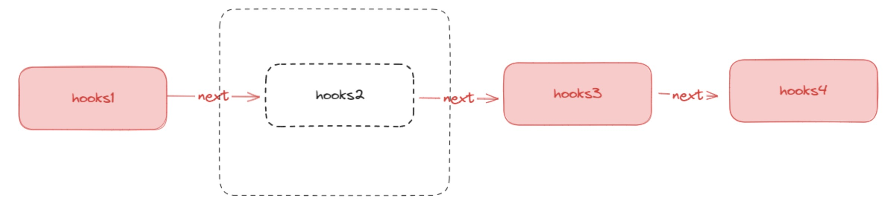
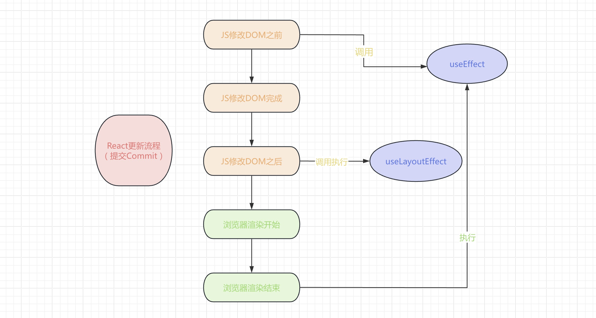
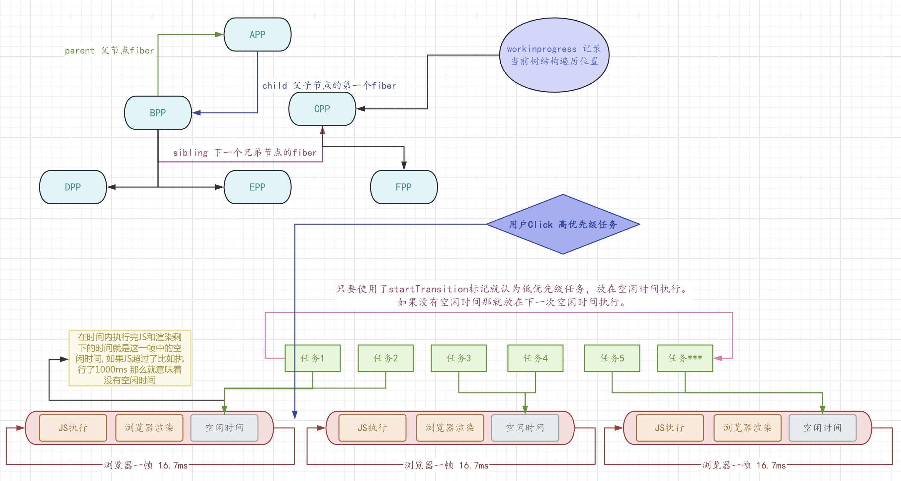

# 一杯咖啡的时间 上手React

## 初始化
``` bash
npx create-react-app project-name
cd project-name
npm start
```

## 入口文件




::: tip react-dom/client

- `react` 的核心其实是一个渲染的库，是一个跨多端的渲染框架。
- `React-dom/client` 是浏览器渲染用的库，同理 `node` 端也有对应的库。
为了功能解耦拆分成了多个包，渲染有渲染专用的包 引擎就只负责引擎。

:::

::: tip React 和 ReactDom 两个包有什么作用？

- `react`：是 `React` 库的核心。它定义了 `React` 组件的创建和生命周期方法，以及 `React` 元素的概念。你可以将其视为 `React` 的 `引擎`。
- `react-dom`：这个库提供了在浏览器环境中使用 `React` 的方法，例如将 `React` 组件渲染到 `DOM` 中，或者在 `DOM` 中触发 `React` 组件的更新。你可以将其视为 `React` 的 `驱动程序`。

:::

::: tip React.StrictMode 严格模式

- 使用过时或遗留的API：严格模式会警告使用过时或遗留的 `API`。
- 不安全的生命周期方法：某些生命周期方法在未来的版本中将被弃用。严格模式会警告这些不安全的方法的使用。
- 与旧版本React不兼容的代码：严格模式会警告你的代码中可能与未来版本不兼容的部分。
- 意外的副作用：严格模式可以帮助你发现组件中可能的意外副作用。

:::

## React 组件
`组件（Components）` 是 `React` 的核心概念之一。它是构建用户界面`（UI）`的基石。

- 函数式组件
``` jsx
function App() {
  return (
    <div className="App">
      <h1>hello App</h1>
    </div>
  )
}
export default App;
```


::: warning
通过 function Profile() { } 形式，你定义了一个名为 Profile 的 JavaScript 函数。

React 组件就是普通的 JavaScript 函数，但 函数名必须以大写字母开头，否则将无法正常使用！
:::

- 类组件 (官方已推荐废弃)
```jsx
class App extends React.Component {
  render() {
    constructor(props) {
      super(props);
    }
    return (
      <div className="App">
        <h1>hello App</h1>
      </div>
    );
  }
}

export default App;
```

::: warning
`render()` 方法是 `class` 组件中唯一必须实现的方法。

在 React.Component 的子类中有个必须定义的 `render` 函数.

在 React.Component 子类实现构造函数时，必须在其他语句之前调用 `super(props)`
:::

## 关于 JSX

- `Jsx` 本质就是`JavaScript`的语法扩展，即`JavaScript XML`。
- `Jsx` 看起来像是一种模板语言，但它具有 `JavaScript` 的全部功能。
- `Jsx` 语法需要经过 [babel](http://babeljs.io/) 编译。

::: tip Jsx的作用:

- `Jsx `作用就是 可以在 `js` 中返回 `dom` , 经过 `babel` 编译成 `js` 认识的代码。




```import { jsx as _jsx } from "react/jsx-runtime";```
- _jsx 来自 `react/jsx-runtime` 这个库的一个方法，这个是 `react` 底层引擎提供的方法，`babel` 进行了默认的编译引入。
- _jsx 第一个参数：标签名
- _jsx 第二个参数：子元素以及标签中的一些属性

:::

## 生命周期


##### 生命周期执行顺序
- 挂载时：`constructor()`、`static getDerivedStateFromProps()`、`render()`、`componentDidMount()`
- 更新时：`static getDerivedStateFromProps()`、`render()`、`getSnapshotBeforeUpdate()`、`componentDidUpdate()`
- 卸载时：`componentWillUnmount()`



>


类组件的生命周期:
> 其实 react 的运行过程就是它的类的实例过程：

``` jsx
import React from "react";

class App2 extends React.Component {
  componentWillUnmount() {
    console.log("componentWillUnmount - 卸载时-在卸载之前被调用");
  }
  render() {
    return <h1>App2</h1>;
  }
}

class App extends React.Component {
  constructor(props) {
    super(props);
    console.log("constructor - 挂载时-在挂载之前被调用");
    this.state = { num: 0, app2Show: true };
  }

  static getDerivedStateFromProps(props, state) {
    console.log(
      "getDerivedStateFromProps - 挂载时-以及更新时 在render前被调用"
    );

    // 对状态拦截修改后的num
    return { num: state.num < 60 ? "不及格" : "及格" };
  }

  render() {
    console.log("render - 挂载时-以及更新时被调用");
    const { num, app2Show } = this.state;

    return (
      <div className="App">
        <h1>{num}</h1>
        <button onClick={() => this.setState({ num: 70 })}>更新num</button>

        <h1>------</h1>

        {app2Show && <App2 />}
        <button onClick={() => this.setState({ num: 0, app2Show: false })}>
          隐藏App2
        </button>
      </div>
    );
  }

  getSnapshotBeforeUpdate(prevProps, prevState) {
    console.log(
      "getSnapshotBeforeUpdate - 更新时-在render之后 浏览器页面更新前被调用"
    );
    return { snapshot: "传递给componentDidUpdate的内容" };
  }

  componentDidUpdate(prevProps, prevState, snapshot) {
    console.log(
      "componentDidUpdate - 更新时-在render之后 浏览器页面更新后被调用"
    );
    console.log(
      "componentDidUpdate - 来自getSnapshotBeforeUpdate传递的内容",
      snapshot
    );
  }

  componentDidMount() {
    console.log("componentDidMount - 组件挂载完成");
  }
}

export default App;
```




::: info constructor
- 挂载时-在挂载之前被调用。
- 实现构造函数时，应在其他语句之前调用 `super`。
- 场景：一般用来初始化内部的 `state`、`事件处理函数` 绑定实例。

:::

::: info static getDerivedStateFromProps(props, state)
- 挂载时-以及更新时 在 `render` 前被调用。
- 参数：`props`：组件即将用来渲染的下一个 `props`。 `state`：组件即将渲染的下一个 `state`。
- 返回值：返回一个对象，会对 `state` 进行相同属性覆盖，如果返回 `null` 则不更新任何内容。
- 场景：人民币转换大小写、银行卡余额转换、手机号等等。

:::

::: info render
- 挂载时-以及更新时被调用，`class` 组件中唯一必须实现的方法。
- 如果 `shouldComponentUpdate()` 返回 `false` ，则不会调用 `render()`。

:::


::: info getSnapshotBeforeUpdate(prevProps, prevState)
- 更新时-在 `render` 之后，`React` 更新 `DOM` 之 `前`。
- 参数：`prevProps`：组件上一个 `props`。`prevState`：组件的上一个 `state`。
- 返回值：返回值会被作为参数传递给 `componentDidUpdate` 钩子。
- 场景：长列表动态插入内容。更新之前记住滚轮的原始位置 再传递给 `componentDidUpdate` 使用原始的位置更新 `dom`  保证滚轮的准确性。

:::

::: info componentDidUpdate(prevProps, prevState, snapshot?)
- 更新时-在 `render` 之后，`React` 更新 `DOM` 之 `后`。
- 参数：`prevProps`、`prevState` 参数：和 `getSnapshotBeforeUpdate` 一致。
- 参数： `snapshot` 是 `getSnapshotBeforeUpdate` 的返回值。

:::


::: info componentDidMount
  - 组件挂载后（插入 DOM 树中）立即调用。
  - 依赖于 DOM 节点的初始化应该放在这里。

:::

::: info componentWillUnmount
- 卸载时-卸载销毁之前被调用。
- 场景：取消网络请求、移除监听事件、清理 `DOM` 元素、清理定时器等。

:::

## React Hooks
> 以 `use` 开头的函数被称为 `Hook`。一个 `hooks` 几乎可以实现 `class` 类组件中的所有生命周期。`hooks` 让书写 `react` 的感觉无限接近于在写 `js`。

### useState
::: details const [state, setState] = useState(initialState)

- 参数：
  - `initialState`: `state`初始化的值。如果传入函数要求返回一个任意值的纯函数，讲作为初始化函数，返回值作为初始状态。

- 返回值：
  - 第一个为当前 `state` 的值。
  - 第二个为 `set` 函数，用来更新 `state` 和触发重新渲染。

:::

::: tip react的更新状态是异步的？

``` jsx {7-9}
import React, { useState } from "react";

function App() {
  const [num, setNum] = useState(0);

  const handleOnClick = () => {
    setNum(num + 1);
    // react的状态更新是异步的，这里的num不是set后的num
    console.log(num);
  };

  return (
    <div className="App">
      <h1>{num}</h1>
      <button onClick={handleOnClick}>Click</button>
    </div>
  );
}

export default App;
```

`react` 的更新状态是异步的，浏览器的渲染和 `JS` 的执行是互斥的。

`react` 为了性能(JS执行一万次不可能让浏览器也渲染一万次) 所以在 `react` 更新底层的异步任务(微任务)队列，会把一段时间内的对组件的修改进行合并，并一次渲染完成。
:::

### useEffect
::: details useEffect(setup, dependencies?)

- 参数：
  - `setup` : 处理 `Effect` 的函数。
  - `dependencies?` : `setup` 中引用的所有响应式值的列表。

- 执行时机 - 未传 `dependencies`:
  - 组件初始化执行
  - 监听组件内所有响应式值的变化 发生变化就会执行 。

- 执行时机 - `dependencies` 传入 `[]`:
  - 组件初始化执行

-  执行时机 -  `dependencies` 传入 `[a,b,c]`:
    - 组件初始化执行
    - 依赖的状态 `[a,b,c]`中任意一个值 发生变化时执行。

- 执行时机 - `setup` 返回的函数:
  - 组件卸载时执行
  - 组件更新时执行（组件更新包含组件卸载操作，先卸载后更新）

``` jsx {9,13,17,18}
import React, { useEffect, useState } from "react";

function App() {
  const [age, setAge] = useState(0);
  const [name, setName] = useState("LISI");
  const [email, setEmail] = useState("abc@qq.com");

  useEffect(() => {
    console.log("dependencies为[] 初始化执行");
  }, []);

  useEffect(() => {
    console.log("dependencies没传 初始化执行 组件内所有响应值变化就执行");
  });

  useEffect(() => {
    console.log( "dependencies为[age] 初始化执行 依赖的age发生变化执行 值为：", age );
    return () => console.log("卸载更新时就会执行：值为", age);
  }, [age]);

  return (
    <div className="App">
      <h1>{age}</h1>
      <button onClick={() => setAge(18)}>改变age</button>
      <h1>{name}</h1>
      <button onClick={() => setName("ZHANGSAN")}>改变name</button>
      <h1>{email}</h1>
      <button onClick={() => setEmail("123@qq.com")}>改变email</button>
    </div>
  );
}

export default App;
```



:::


::: tip useEffect的返回函数的作用？

``` jsx {2,3}
useEffect(() => {
    console.log( "dependencies为[age] 初始化执行 依赖的age发生变化执行 值为：", age ); // 18
    return () => console.log("卸载更新时就会执行：值为", age); // 0
  }, [age]);
```

- useEffect 返回的函数的状态永远是 上一次的状态 。
- 应用场景：应用于卸载操作:
``` jsx
// 聊天软件 打开聊天窗口 A，然后打开聊天窗口 B，这时 和 B 建立连接，和上一次的也就是 A 断开链接：
useEffect(() => {
  connect(user)
  return disConnect(user)
},[user])
```
:::


::: tip hooks 不能写在条件判断或函数内部中，只能写在当前组件的顶级作用域。
hooks是用链表这种数据结构来进行连接的，通过next属性保持执行顺序。如果中间的断开，会导致后面的钩子找不到。


:::

### useLayoutEffect
::: details useLayoutEffect(setup, dependencies?)
- `useLayoutEffect` 是 `useEffect` 的一个版本，在浏览器重新绘制屏幕之前触发。

:::

::: tip  useLayoutEffect 与 Effect 区别：
  - `useLayoutEffect` 可能会影响性能，尽可能使用 `useEffect`。
 - `useLayoutEffect` 是同步执行，`useEffect` 是异步执行。
  - `useEffect` 是异步，在 `JS修改DOM前` 调用，在 `浏览器完成渲染` 后执行。
  - `useLayoutEffect` 是同步，在 `JS修改DOM之后` 调用执行。
  - 所以效果是 `useLayoutEffect` 早于 `useEffect`。


:::

### useMemo
::: details const cachedValue = useMemo(calculateValue, dependencies)
- 用于 `react` 渲染过程中的性能优化。
- 它在每次重新渲染的时候能够缓存计算的结果。
- 在项目中不得已使用的时候再去使用 `useMemo`，它自身状态就有性能的消耗，缓存也消耗内存。
- `useMemo` 会增加开发成本，代码变得很复杂不好维护。
- `react` 官方会在未来取消这个钩子。

- 场景：父组件进行更新，子组件的计算量很大并且结果可以复用，就可以使用 `useMemo` 来提升父组件引起子组件不必要渲染的性能优化。

:::


### useCallback
::: details const cachedFn = useCallback(fn, dependencies)
- 用于 `react` 渲染过程中的性能优化。
- 允许你在多次渲染中缓存函数，对函数引用的缓存。

:::

::: tip React 的渲染规律：
- 只要对父组件 进行状态修改，父组件会重新渲染，父组件中的所有子组件也会重新渲染。

:::

::: tip useMemo 和 useCallback 的区别：
- 其实没有本质区别， `useMemo` 用于缓存数据，`useCallback` 用于缓存函数。
- 就是为了提高代码的可维护性和可读性。

:::

### useRef
::: details const ref = useRef(initialValue)

- 用 `ref` 引用一个值，改变 `ref` 不会触发重新渲染。（储存一些不影响组件视图输出信息的完美选择）

  ``` js const intervalRef = useRef(0); ```

- 通过 `ref` 操作 `DOM`，当节点从屏幕上移除时，`React` 将把 `current` 属性设置回 `null。`

  ``` js   const inputRef = useRef(null); ```

- 避免重复创建 `ref` 的内容，React 会保存 ref 初始值，并在后续的渲染中忽略它。

:::

### forwardRef
::: details const SomeComponent = forwardRef(render)
- 允许组件使用 `ref` 将 `DOM` 节点暴露给父组件， 默认情况下，组件不会将它们的 `DOM` 节点暴露给父组件。。
- 函数式组件是没有 `ref` 的，可以通过 `forwardRef` 转发出去。

``` jsx
import { forwardRef } from 'react';

const MyInput = forwardRef(function MyInput(props, ref) {
  return <input ref={ref} />
});
```

:::

### useContext
::: details const value = useContext(SomeContext)
- 可以让你读取和订阅组件中的 `context`。向组件树深层传递数据。主要用于跨组件传值。
- 父组件使用`Provider`包裹，给所有子组件注入上下文（值）。子孙组件就可以通过`useContext`拿到顶层组件注入的值。

``` jsx {3,6,12,16}
import React, { createContext, useContext, useState } from "react";

const AppContext = createContext(null);

function OtherComponents() {
  const data = useContext(AppContext);
  return <h1>{data.count}</h1>;
}

function App() {
  const [count, setCount] = useState(0);

  return (
    <AppContext.Provider value={{ count, setCount }}>
      <div className="App">
        <OtherComponents />
      </div>
    </AppContext.Provider>
  );
}
```

:::

### useTransition
::: details const [isPending, startTransition] = useTransition()
- 在不阻塞 UI 的情况下更新状态。(并发更新。fiber架构)。
- 用于优化耗时组件造成的性能影响。
- 参数：
  - `isPending` : 告诉你是否存在待处理的 `transition`。
  - `startTransition` : 你可以使用此方法将状态更新标记为 `transition`。

- 通过 `transition`，UI` 仍将在重新渲染过程中保持响应性。例如用户点击一个选项卡，但改变了主意并点击另一个选项卡，他们可以在不等待第一个重新渲染完成的情况下完成操作。

``` jsx {2,6-8}
function TabContainer() {
  const [isPending, startTransition] = useTransition();
  const [tab, setTab] = useState('about');

  function selectTab(nextTab) {
    startTransition(() => {
      setTab(nextTab);
    });
  }
  // ……
}
```

:::

::: tip 关于React并发更新（fiber架构、分片更新、异步更新）:
- 组件总是等到所有的 `js` 执行完，才会开始渲染。`js` 是单线程，所以当有一个耗时的任务，后续的任务都会被阻塞，就会卡住渲染。

``` html
// 打开页面点击按钮 render 一直在执行，handleClick 一直没有执行。界面处于卡死状态:

<button onclick="handleClick()">按钮</button>
<script>
  function handleClick() {
    console.log('click')
  }
  function render() {
    for (let i = 0; i < 10 ** 5; i++) {
      console.log('render执行中')
    }
  }
  window.onload = function () {
    render()
  }
</script>
```

- 浏览器的空闲时间 利用浏览器的API `requestIdleCallback`的思想。这个函数将在浏览器空闲时被调用。
  - 通常情况下，浏览器的一帧为`16.7ms`。`js`是单线程，也就是`click` 事件，宏任务，微任务，`requestAnimatinFrame`，`requestIdleCallback`等等都会在浏览器帧里按顺序去执行。
  - `requestIdleCallback` 表示的是浏览器里每一帧里在确保其他任务完成时，还剩余的时间。
  - `requestIdleCallback` 目前兼容性不好，`react` 当前使用的是 `postMessage`。他是宏任务的异步。

- 更新优先级
  - 在 `React` 中，更新分为两种，紧急更新和过渡更新(点击，输入，按键等等都属于紧急更新)
  - `React` 为通过 `lane` 的方式每个更新分配了相关优先级。`lane` 可以简单理解为一些数字，数值越小，表明优先级越高。

- `fiber` 架构:
  - `React` 传统的 `Reconciler` 是通过类似于 `虚拟DOM` 的方式来进行对比和标记更新。虚拟 `DOM` 的结构不能很好满足将更新拆分的需求。因为它一旦暂停对比过程，下次更新时，很难找到上一个节点和下一个节点的信息。
  - `Fiber` 通过链表的形式来记录节点之间的关系，使用三个属性 进行连接 `child`、`parent`、`sibling`。
  - 使用指针 `workinprogress` 记录当前遍历到的树结构。
  - 基于 `Fiber` 数据结构进行细粒度的任务拆分，在浏览器空闲时间执行。



:::

::: tip useTransition和useDeferredValue的区别:

- 解决的问题是一样的。都是降低优先级。只是应用场景的细微的区别。
- `useDeferredValue` 比较适合用于组件接收的 `props` 参数导致渲染性能的优化。
  - 比如我使用的是别人的开发的组件。我作为使用者，想把他变成低优先级来优化这个组件的渲染。
- `useTransition` 比较适合在自己组件内部本身来进行优化。
  - 如果我是组件的开发者，我希望优化这个组件有很好的性能并提供给别人使用。

:::

### useId
::: details const id = useId()
- 组件渲染过程中生成一个 `ID`。
- 可以生成传递给无障碍属性的唯一 `ID`。
- 这个 `ID` 是 `react` 组件树的位置相关的，每次生成都一样。不是随机的。
- 在 `Nodejs` 做 `react` 服务端渲染时需要确保 `Node` 端生成的 `ID` 和浏览器一致。

:::

### useImperativeHandle
::: details useImperativeHandle(ref, createHandle, dependencies?)

- 向父组件暴露一个自定义的 `ref`，通过 `forwardRef` 转发出去。
- 我不希望开发者直接操作 `dom`，我只提供方法，你用我给你定义的方法就好。

``` jsx
const MyInput = forwardRef(function MyInput(props, ref) {
  useImperativeHandle(ref, () => {
    return {
      // ... 你的方法 ...
    };
  }, []);

  return <input {...props} />;
});
```

:::

### useInsertionEffect

::: details useInsertionEffect(setup, dependencies?)
- 可以在布局副作用触发之前将元素插入到 `DOM` 中。
- 是为 `CSS-in-JS` 库的作者特意打造的。除非你正在使用 `CSS-in-JS` 库并且需要注入样式，否则你应该使用 `useEffect` 或者 `useLayoutEffect`。
- `useInsertionEffect` 比在 `useLayoutEffect` 或 `useEffect` 期间注入样式更好。因为它会确保 `<style> `标签在其它 `Effect` 运行前被注入。否则，正常的 `Effect` 中的布局计算将由于过时的样式而出错。

:::

### useSyncExternalStore

::: details const snapshot = useSyncExternalStore(subscribe, getSnapshot, getServerSnapshot?)
- 一个让你订阅外部 `store` 的 `React Hook`，也是为库的作者使用的。
- 解决 `react`并发更新带来的问题 ，`tearing` 状态撕裂的问题。

:::