# 一杯咖啡的时间 初始化Vue通用模板
> 一杯不够的话请再来一杯。

## 🐬 初始化项目

### 🐬 创建项目

- 使用 [Vite](https://vitejs.dev/) 创建项目

`npm init vite@latest project-name`

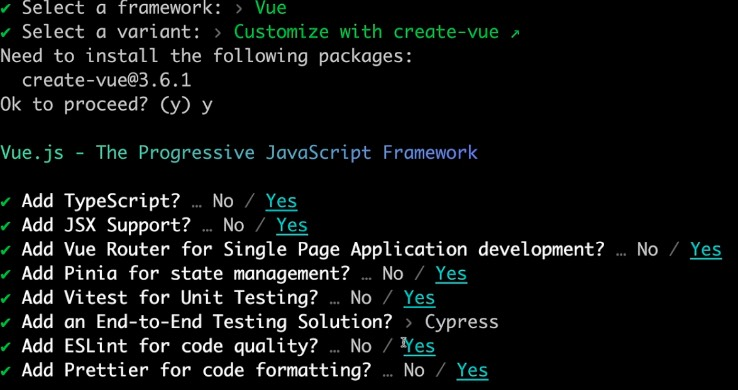

::: info 选项
Add TypeScript? - 是否使用 TypeScript 语法？
Add JSX Support? - 是否使用 JSX 支持？
Add Vue Router for Single Page Application development? - 是否引入 Vue Router 进行单页面应用开发？
Add Pinia for state management? - 是否引入 Pinia 用于状态管理？
Add Vitest for Unit Testing? - 是否引入 Vitest 用于单元测试？
Add an End-to-End Testing solution? - 是否引入一个 端到端测试工具？
Add EsLint for code quality? - 是否引入 Eslint 用于代码质量检测？
Add Prettier fro code formatting? - 是否引入 Prettier 用于代码格式化？
:::

### 🐬 安装依赖
- 使用 `pnpm install` 安装项目依赖

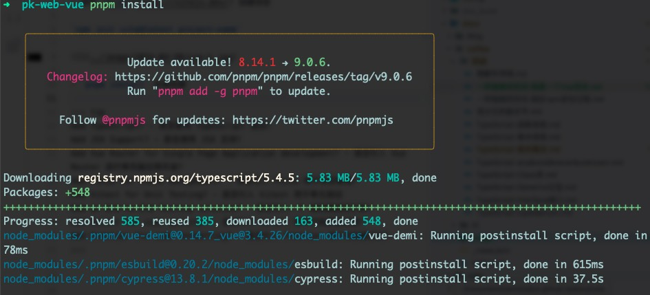

### 🐬 删除不必要的文件

``` bash
rm -d src/components/icons

rm src/components/HelloWorld.vue src/components/TheWelcome.vue src/components/WelcomeItem.vue

rm src/views/AboutView.vue src/stores/counter.ts src/assets/base.css
```

### 🐬 改造默认文件代码
``` css title="src/assets/main.css"
// 清空main.css代码
```

``` ts title="router/index.ts"
import { createRouter, createWebHistory } from 'vue-router'
import HomeView from '../views/HomeView.vue'

const router = createRouter({
  history: createWebHistory(import.meta.env.BASE_URL),
  routes: [
    {
      path: '/',
      name: 'home',
      component: HomeView
    }
  ]
})

export default router
```

``` html title="src/views/HomeView.vue"
<template>
  <main>hello</main>
</template>
```

``` html title="src/App.vue"
<script setup lang="ts">
import { RouterView } from 'vue-router'
</script>

<template>
  <RouterView />
</template>
```

### 🐬 重置默认样式

- 使用 `pnpm install reset-css` 安装 [reset.css](https://www.npmjs.com/package/reset-css)

- 在 `main.ts` 中引入 `reset-css`

``` ts title="src/main.ts" {8,9}
import './assets/main.css'

import { createApp } from 'vue'
import { createPinia } from 'pinia'

import App from './App.vue'
import router from './router'
// + 引入
import 'reset-css'

const app = createApp(App)

app.use(createPinia())
app.use(router)

app.mount('#app')
```

::: tip
可以自行选择其他库，比如选择 `normalize.css`
:::

### 🐬 运行项目
- 使用 `pnpm dev` 运行项目:
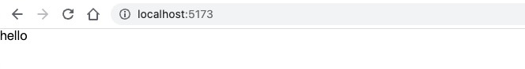

## 🐬 自动路由方案
> 手动路由：路由配置文件会非常冗长、配置文件难以维护。

> 自动路由：提升效率。约定是否大于配置？

### 🐬 方案1: [vite-plugin-pages](https://github.com/hannoeru/vite-plugin-pages)

  > File system based route generator for Vite （基于文件系统的路由生成方案）

  > 为vite而设计 webpack等其他场景不适用

#### 🐬 安装 vite-plugin-pages

``` bash
pnpm install -D vite-plugin-pages
```

#### 🐬 配置 plugins
``` ts title="vite.config.ts" {6,7,11,12}
import { defineConfig } from 'vite'
import vue from '@vitejs/plugin-vue'
import vueJsx from '@vitejs/plugin-vue-jsx'
import { fileURLToPath, URL } from 'node:url'

// + 引入
import Pages from 'vite-plugin-pages'

export default defineConfig({
  plugins: [vue(), vueJsx(),
    // + 使用
    Pages()
  ],
  resolve: {
    alias: {
      '@': fileURLToPath(new URL('./src', import.meta.url))
    }
  }
})
```

:::info Pages 配置
配置路径: Pages({ dirs: ['src/views']}) (默认为 pages)
``` ts
Pages({
  dirs: [
    // basic
    { dir: 'src/pages', baseRoute: '' },
    // features dir for pages
    { dir: 'src/features/**/pages', baseRoute: 'features' },
    // with custom file pattern
    { dir: 'src/admin/pages', baseRoute: 'admin', filePattern: '**/*.page.*' },
  ],
}),
```
关于 Pages 更多配置项可查阅 [文档](https://github.com/hannoeru/vite-plugin-pages)
:::

#### 🐬 配置 router
``` ts title="src/router/index.tsx" {2,3,7,8}
import { createRouter, createWebHistory } from 'vue-router'
// +
import routes from '~pages'

const router = createRouter({
  history: createWebHistory(import.meta.env.BASE_URL),
  // +
  routes
})

export default router
```

#### 🐬 添加类型
"router/index.ts 找不到模块“~pages”或其相应的类型声明。" 处理：

``` ts title="env.d.ts"
/// <reference types="vite-plugin-pages/client" />
```

#### 🐬 测试效果

- 新建 `pages` 目录 并添加文件
``` bash
mkdir src/pages
cd src/pages
touch index.vue page1.vue page2.vue

# 重启项目
pnpn dev
```

``` html title="src/pages/index.vue"
<template>
  <div>Hello Index</div>
</template>
```

``` html title="src/pages/page1.vue"
<template>
  <div>Hello Page1</div>
</template>
```

``` html title="src/pages/page2.vue"
<template>
  <div>Hello Page2</div>
</template>
```

- 访问 index:


- 访问 page1:
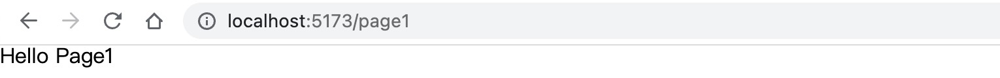

- 访问 page2:
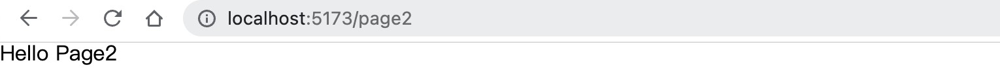


#### 🐬 配置 `Catch-all Routes`
- `Catch-all Routes` (所有路由匹配) 用包含省略号的方括号表示:
``` bash
src/pages/[...all].vue -> /* (/non-existent-page)
```

- `pages` 目录添加文件 `[...all].vue`
``` html title="src/pages/[...all].vue"
<template>
  <div>404 page</div>
</template>
```

- 所有访问不到的路径 都被引导到了:


### 🐬 方案2: [unplugin-vue-router](https://github.com/posva/unplugin-vue-router)

  > Next Generation file based typed routing for Vue Router (下一代基于文件系统的类型路由方案)

#### 🐬 安装 unplugin-vue-router

``` bash
pnpm install -D unplugin-vue-router
```

#### 🐬 配置 plugins
``` ts title="vite.config.ts" {6,7,11,12}

import { defineConfig } from 'vite'
import vue from '@vitejs/plugin-vue'
import vueJsx from '@vitejs/plugin-vue-jsx'
import { fileURLToPath, URL } from 'node:url'

// + 引入
import VueRouter from 'unplugin-vue-router/vite'

export default defineConfig({
  plugins: [
    // + 使用  Vue 必须放在 VueRouter() 之后
    VueRouter(),
    vue(),
    vueJsx()
  ],
  resolve: {
    alias: {
      '@': fileURLToPath(new URL('./src', import.meta.url))
    }
  }
})
```

::: warning 注意
Vue的插件一定要在 VueRouter的后面进行注册配置。
Vite在使用插件时有顺序要求。
:::

::: info 基于其他工具
更多关于 Rollup 、 Webpack、 Vue CLI、 esbuild的使用可阅读 [文档](https://github.com/posva/unplugin-vue-router)
:::

#### 🐬 配置 router
``` ts title="src/router/index.tsx" {3-5}
// - import { createRouter, createWebHistory } from 'vue-router'

// + 将导入的内容从 替换vue-router为vue-router/auto
import { createRouter, createWebHistory } from 'vue-router/auto'
import { routes } from 'vue-router/auto-routes'

const router = createRouter({
  history: createWebHistory(import.meta.env.BASE_URL),
  routes
})
export default router
```

#### 🐬 添加类型
"模块“"vue-router/auto"”没有导出的成员“createRouter”。" 处理：
``` ts title="env.d.ts" {2}
/// <reference types="vite/client" />
/// <reference types="unplugin-vue-router/client" />
```

::: tip
如果没有文件env.d.ts，可以创建一个文件并将 unplugin-vue-router 类型添加到其中，或者可以将它们添加到 tsconfig.json
``` json
{
  "compilerOptions": {
    // ...
    "types": ["unplugin-vue-router/client"]
  }
}
```
:::

#### 🐬 测试效果
- 访问 index:


- 访问 page1:


- 访问 page2:


## 🐬 CSS框架方案
> UI库有特定的场景, UI库中把样式都已写好，如果你想定制样式，需要修改自定义的样式文件或定制主题、并熟悉该UI框架的文档。按要求进行修改。

> 搭建一个通用的框架 推荐使用 CSS框架(原子化 CSS 引擎)。可以按照自己的想法来书写。当实现一些定制性强的需求 (如首页、很难去复用各UI库的样式)。

### 🐬 方案1: [tailwindcss](https://github.com/tailwindlabs/tailwindcss)
🫱[文档](https://tailwindcss.com/)

#### 🐬 安装 Tailwind CSS
生成 `tailwind.config.js` `postcss.config.js`

``` bash
pnpm install -D tailwindcss postcss autoprefixer
npx tailwindcss init -p
```

#### 🐬 配置模板路径

``` js title="tailwind.config.js" {3-5}
/** @type {import('tailwindcss').Config} */
export default {
  content: [
    "./index.html",
    "./src/**/*.{vue,js,ts,jsx,tsx}",
  ],
  theme: {
    extend: {},
  },
  plugins: [],
}
```

#### 🐬 添加 Tailwind 指令
``` css title="src/assets/main.css"
@tailwind base;
@tailwind components;
@tailwind utilities;
```

``` ts title="src/main.ts" {2,3}
// ...
// 引入main.css
import './assets/main.css'
// ...
```

#### 🐬 使用 Tailwind
``` html title="src/pages/index.vue" {3,4}
<template>
  <div>Hello Index</div>
  <!-- 测试 -->
  <h1 class="text-3xl font-bold underline">Hello Tailwind!</h1>
</template>
```

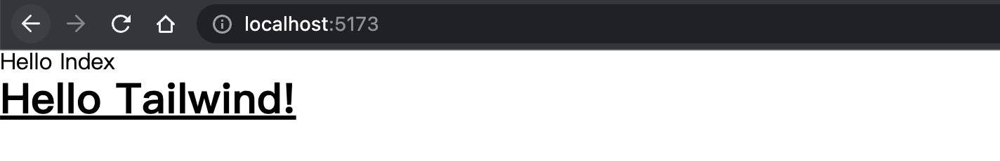


### 🐬 方案2: [unocss](https://github.com/unocss/unocss)
🫱[文档](https://unocss.dev/)

#### 🐬 安装 初始化
``` bash
pnpm add -D unocss
```

#### 🐬 注册插件
``` ts title="vite.config.ts" {2,3,8,9}
...
// + 引入UnoCSS
import UnoCSS from 'unocss/vite'

export default defineConfig({
  plugins: [
    ...
    // + 注册UnoCSS
    UnoCSS()
  ],
  ...
})
```

#### 🐬 配置
``` bash
touch uno.config.ts
```

``` ts title="uno.config.ts" {1-5}
import { defineConfig } from 'unocss'

export default defineConfig({
  // ...UnoCSS options
})
```

``` ts title="src/main.ts" {2}
// + 引入
import 'virtual:uno.css'
```

#### 🐬 测试效果
``` html title="src/pages/index.vue" {3,4}
<template>
  <div>Hello Index</div>
  <!-- p-4 :padding: 1rem -->
  <div class="p-4">Hello UnoCSS</div>
</template>
```
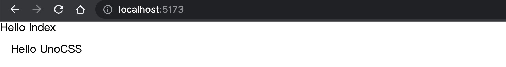


#### 🐬 使用 Presets

- `UnoCSS` 提供了很多 `Presets`，这样我们就可以在  `UnoCSS` 中使用 `tailwindcss`的类和写法。

- 使用 `Wind preset`

``` bash
pnpm add -D @unocss/preset-wind
```

- 配置
``` ts title="uno.config.ts" {2,3,7-9}
import { defineConfig } from 'unocss'
// + 引入presetWind
import presetWind from '@unocss/preset-wind'

export default defineConfig({
  // ...UnoCSS options
  presets: [
    presetWind(),
  ],
})
```

- 使用
``` html title="src/pages/index" {4-6}
<template>
  <div>Hello Index</div>
  <div class="p-4">Hello UnoCSS</div>
  <h1 class="text-3xl font-bold underline">
    Hello world!
  </h1>
</template>
```
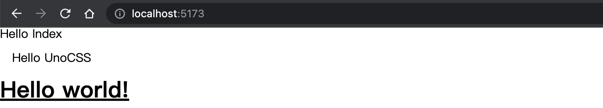

- 文档也提供了更多 `Presets` 官方 [Presets](https://unocss.dev/presets/#official-packages)  和  社区 [Presets](https://unocss.dev/presets/community#community-presets)


::: tip 关于重置样式表
其实  `tailwindcss & unocss` 都自带了 `reset css`。

可以移除掉 `reset-css` 使用框架的 `reset`。

在 `tailwindcss`中关于 [base style](https://tailwindcss.com/docs/preflight)

在 `unocss`中关于 [style-reset](https://unocss.dev/guide/style-reset)

根据需求选择合适的重置样式表、以确保网页的一致性和可靠性 (比如选择 [Tailwind](https://unocss.dev/guide/style-reset#tailwind))
:::


::: tip
如何选择 `tailwindcss & unocss`

如果对于项目提及有要求或新能有要求 推荐`unocss`，`unocss` 的特点就是速度快、体积小。

如果追求稳定性，以及后续的更新支持 和完整的文档 推荐 `tailwindcss`。

这里官方文档也说明了不同: [How is UnoCSS Different from X?](https://unocss.dev/guide/why#how-is-unocss-different-from-x)

当然 `unocss`使用 `Wind preset` 是个不错的方案！🎉
:::

## 🐬 自动导入 AutoImport

> 在项目中，频繁引入依赖包是一个常见的操作，但手动引入依赖包往往繁琐。可以通过自动导入的插件，就可以自动导入我们的API。打包时也会按需打包 不会额外增加负担。

### 🐬 安装 [unplugin-auto-import](https://github.com/unplugin/unplugin-auto-import)

``` bash
pnpm i -D unplugin-auto-import
```

### 🐬 配置 unplugin-auto-import

``` ts title="vite.config.ts" {1,2,10,11}
// + 引入
import AutoImport from 'unplugin-auto-import/vite'

export default defineConfig({
  plugins: [
    VueRouter(),
    vue(),
    vueJsx(),
    UnoCSS(),
    // + 注册
    AutoImport(),
  ],
  resolve: {
    alias: {
      '@': fileURLToPath(new URL('./src', import.meta.url))
    }
  }
})
```

> 重启项目后会看到生成的类型文件 `auto-imports.d`

- 配置 AutoImport

``` ts title="vite.config.ts" {1,2,16-18}
// + 引入
import { VueRouterAutoImports } from 'unplugin-vue-router'

 AutoImport({
  // targets to transform (哪些文件需要解析)
  include: [
    /\.[tj]sx?$/, // .ts, .tsx, .js, .jsx
    /\.vue$/,
    /\.vue\?vue/, // .vue
    /\.md$/ // .md
  ],

  // global imports to register (全局需要注册的内容)
  imports: [
    'vue',
    // + 这里使用的是 unplugin-vue-router 而不是 vue-router
    // + 要使用我们选择的自动路由方案
    VueRouterAutoImports
  ]
})
```

> 配置完可以看到  `auto-imports.d` 文件。导入了上面 `imports` 内容。

- 增加 `auto-imports.d.ts` 到 `tsconfig.app.json > include`
``` json title="tsconfig.app.json" {2}
"extends": "@vue/tsconfig/tsconfig.dom.json",
"include": ["env.d.ts", "src/**/*", "src/**/*.vue", "typed-router.d.ts", "auto-imports.d.ts"],
"exclude": ["src/**/__tests__/*"],
```

### 🐬 测试

- 测试使用 [vueuse](https://vueuse.org/)

``` bash
pnpm i @vueuse/core
```

``` ts title="vite.config.ts"
 AutoImport({
  // ......
  // global imports to register (全局需要注册的内容)
  imports: [
    'vue',
    VueRouterAutoImports,
    // + 要使用我们选择的自动路由方案
    '@vueuse/core'
  ]
})
```

``` html title="src/pages/index.vue" {5,6,10-13}
<template>
  <div>Hello Index</div>
  <div class="p-4">Hello UnoCSS</div>
  <h1 class="text-3xl font-bold underline">Hello world!</h1>
  <div>{{ msg }}</div>
  <div>pos: {{ x }}, {{ y }}</div>
</template>

<script setup lang="ts">
// 这里可以不在vue的核心库中进行引入 ref 了
const msg = ref('hello auto import')
// 可以不在vueuse的核心库中进行引入 useMouse
const { x, y } = useMouse()
</script>
```

::: warning 权衡
并非所以依赖都适合自动导入，项目内的代码就不一定适合。
自动引入后，从开发的角度就会丢失依赖链路，虽然另外生成了 Typescript 声明文件，IDE 能够正常识别， 但对于新加入项目的同学来说，他们不一定知道是自动引入，因此可能会降低了一些可读性。
因此要有权衡。

世上没有银弹，我们无法在一开始就设计出完美的方案。
:::

## 🐬 自动组件注册

[unplugin-vue-components](https://github.com/unplugin/unplugin-vue-components) 解决的是在 `vue` 项目中自动导入以 `.vue`、`.ts`、`.tsx`这些组件。使用插件结合 `setup` 语法糖，让编写变得更加方便。

> DRY 原则是编写程序中，经常会用到的概念 (Don't Repeat Yourself 不要重复你自己)

> 程序员可以让程序帮我们做很多重复的事情。大大提高效率。

### 🐬 安装 [unplugin-vue-components](https://github.com/unplugin/unplugin-vue-components)

``` bash
pnpm i -D unplugin-vue-components
```

### 🐬 配置

``` ts title="vite.config.ts"
// ......
// + 引入
import Components from 'unplugin-vue-components/vite'

export default defineConfig({
  plugins: [
    // ......
    // + 注册 plugins
    Components(),
  ],
})
```

- 重启调试进程后同样会生成 一个 `d.ts` 类型文件 `components.d.ts`
- 同样把它加入到 `tsconfig.app.json`，让 `ts` 程序能够识别。

``` json title="tsconfig.app.json" {3}
"extends": "@vue/tsconfig/tsconfig.dom.json",
"include": ["env.d.ts", "src/**/*", "src/**/*.vue", "typed-router.d.ts", "auto-imports.d.ts",
  "components.d.ts"],
"exclude": ["src/**/__tests__/*"],
```

### 🐬 测试

> 在 [官方文档-默认配置](https://github.com/unplugin/unplugin-vue-components?tab=readme-ov-file#configuration) 中可以看到，
默认它的组件找寻路径是 `src/components`

``` bash
touch src/components/HelloWorld.vue
```

``` html title="src/components/HelloWorld.vue"
<template>
  <h3>Hello World Component</h3>
</template>
```

- 同样也支持子目录的组件
``` bash
touch src/components/user/UserComponent.vue
```

``` html title="src/components/user/UserComponent.vue"
<template>
  <h3>Hello User Component</h3>
</template>
```

``` html title="src/pages/index.vue"
<template>
  <!-- 不需要引入就可以使用 组件 -->
  <HelloWorld></HelloWorld>
  <UserComponent></UserComponent>
</template>
```

::: tip
在 [官方文档-默认配置](https://github.com/unplugin/unplugin-vue-components?tab=readme-ov-file#configuration) 中 同名组件 是不会进行覆盖 默认 `false`：
``` ts
// Allow for components to override other components with the same name
// (允许组件覆盖同名的其他组件)
allowOverrides: false,
```

在我们创建组件时一般会规避出现同名组件的情况。但如果有这种情况。我们通常也会加上组件的 私缀 来处理：
在默认配置中：
``` ts
// Allow subdirectories as namespace prefix for components.(允许子目录作为组件的命名空间前缀。)
directoryAsNamespace: false,
```

可以更改为 `true`：
``` ts title="vite.config.ts"
// ......
Components({ directoryAsNamespace: true,}),
```

``` ts title="src/pages/index.vue"
<UserUserComponent></<UserUserComponent>
```

可以发现 在 `components.d.ts` 中的变化：
``` ts
// before
UserComponent: typeof import('./src/components/user/UserComponent.vue')['default']
// after 带上了文件夹最为前缀
UserUserComponent: typeof import('./src/components/user/UserComponent.vue')['default']
```

当然也可以省略与组件相同的前缀: `collapseSamePrefixes: true,`
``` ts
UserComponent: typeof import('./src/components/user/UserComponent.vue')['default']
UserUserComponent: typeof import('./src/components/user/UserComponent.vue')['default']
```
:::

## 🐬 [iconify](https://iconify.design/) 图标方案

### 🐬 安装
- unocss 中使用 `Iconify` 作为图标数据源 🫱[文档](https://unocss.dev/presets/icons#install)

- 使用 `@iconify-json/*(图标集)` 下载相应的图标集。也可以一次安装 `Iconify` 上所有可用的图标集 (`@iconify/json` 数据量大 建议选择常用合集下载)

``` bash
pnpm i -D @iconify/json
```

### 🐬 unocss 配置 iconify

``` ts title="uno.config.ts" {2,3,10-18}
import { defineConfig } from 'unocss'
// + 引入 presetWind presetIcons
import { presetWind, presetIcons } from 'unocss'

export default defineConfig({
  // ...UnoCSS options
  presets: [
    presetWind(),

    presetIcons({
      // 设置前缀
      prefix: 'i-',
      // 设置额外的css属性
      extraProperties: {
        display: 'inline-block',
        'vertical-align': 'middle'
      }
    })
  ]
})
```

### 🐬 测试
按照[文档](https://unocss.dev/presets/icons#install)约定来使用图标
- `<prefix><collection>-<icon>`
- `<prefix><collection>:<icon>`

``` html title="src/pages/index.vue" {1-20}
<template>
  <!-- A basic anchor icon from Phosphor icons -->
  <div class="i-ph-anchor-simple-thin" />
  <!-- An orange alarm from Material Design Icons -->
  <div class="i-mdi-alarm text-orange-400" />
  <!-- Twemoji of laugh, turns to tear on hovering -->
  <div class="i-twemoji-grinning-face-with-smiling-eyes hover:i-twemoji-face-with-tears-of-joy" />

  <!-- 前缀 图标集:图标名称。 也可以设置style -->
  <div class="i-carbon:4k-filled" style="color: green; font-size: 60px"></div>
</template>
```

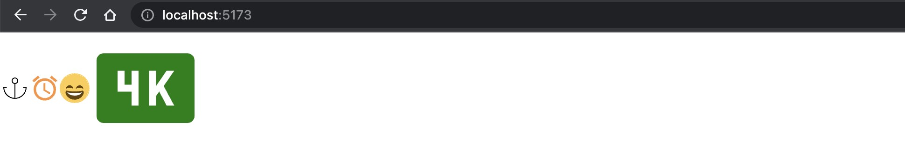


::: tip
图标是项目中不可或缺的一部分，常见的有 [FontAwesome](https://fontawesome.com/)、[iconfont](https://www.iconfont.cn/)、和各UI库中包含的图标集等等。这些能应对大多数的场景。
但是都有一定的局限性：不是完全免费、如果不从设计的角度出发会导致风格不一致、不方便进行颜色、样式修改等。

除了使用的 [iconify](https://iconify.design/) 之外还有很多类似的库：[Lucide](https://lucide.dev/)、[Heronicons](https://heroicons.com/)、[Pikaicons](https://icon.pikaicons.com/)、[iconic](https://iconic.app/)、[react-icons](https://react-icons.github.io/react-icons/)，根据需求进行选择即可。按照各文档也可以集成 [tailwindcss](https://github.com/tailwindlabs/tailwindcss) 或其他库。

[unplugin-icons](https://github.com/unplugin/unplugin-icons)
:::

## 🐬 全局 Layouts
> 除了一级路由 在项目中还涉及不同层级使用同一组布局的情况也就是嵌套路由。

### 🐬 安装 [vite-plugin-vue-layouts](https://github.com/johncampionjr/vite-plugin-vue-layouts)
``` bash
npm install -D vite-plugin-vue-layouts
```

### 🐬 配置

``` ts title="vite.config.ts" {2,3,10-13}
// ......
// 引入
import Layouts from 'vite-plugin-vue-layouts';

export default {
  // ......
  plugins: [
    // ......
    // 注册插件 并传入配置
    Layouts({
      layoutsDirs: 'layout', // 布局文件
      defaultLayout: 'default' // 默认布局
    })
  ],
};
```

- 注意使用的并不是 `vue-router`

``` ts title="src/router/index.ts" {2,3,8}
import { createRouter, createWebHistory } from 'vue-router/auto'
// + 引入
import { setupLayouts } from 'virtual:generated-layouts'
import { routes } from 'vue-router/auto-routes'

const router = createRouter({
  history: createWebHistory(import.meta.env.BASE_URL),
  routes: setupLayouts(routes)
})

export default router
```

### 🐬 测试

- 在 `src` 创建 `layouts` 文件夹以及 `default.vue` 文件
``` html title="src/layouts/default.vue"
<template>
  <h1 class="text-3xl font-bold underline">this is default layout</h1>
  <header class="text-2xl">this is default header</header>

  <div class="flex space-x-4 underline">
    <router-link to="/">index</router-link>
    <router-link to="/page1">page1</router-link>
    <router-link to="/page2">page2</router-link>
  </div>

  <router-view></router-view>
  <footer class="text-2xl">this is default footer</footer>
</template>
```

- 在 `src/layouts` 文件夹创建 `home.vue` 文件
``` html title="src/layouts/home.vue"
<template>
  <div class="text-3xl font-bold underline">this is home layout</div>
  <header class="text-2xl">this is home header</header>
  <router-view></router-view>
  <footer class="text-2xl">this is home footer</footer>
</template>
```

- 指定 `index layout` 为 `home`，`page1、page2` 为 `default`
``` html title="src/pages/index.vue" {6-9}
<template>
  <!-- 前缀-图标集:图标名称来使用图标。 也可以设置style -->
  <div class="i-carbon:4k-filled" style="color: green; font-size: 60px"></div>
</template>

<route lang="yaml">
meta:
  layout: home
</route>
```

``` html title="src/pages/page1.vue" {5-8}
<template>
  <div>Hello Page1</div>
</template>

<route lang="yaml">
meta:
  layout: default
</route>
```

``` html title="src/pages/page2.vue" {5-8}
<template>
  <div>Hello page2</div>
</template>

<route lang="yaml">
meta:
  layout: default
</route>
```


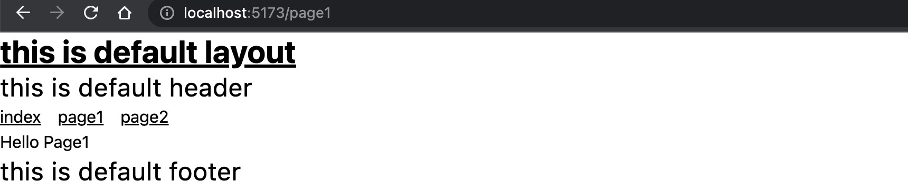

> 还可以配置过渡效果、参数传递等。阅读🫱 [官方文档](https://github.com/johncampionjr/vite-plugin-vue-layouts?tab=readme-ov-file#transitions)

## 🐬 NPM依赖更新策略

### 🐬 方案1: 自定义更新
`npm install 包名@版本号`

### 🐬 方案2: 借助 npm 工具

#### [npm-check](https://www.npmjs.com/package/npm-check)
- 全局安装  `npm install -g npm-check`
- 使用  `npm-check` 检查

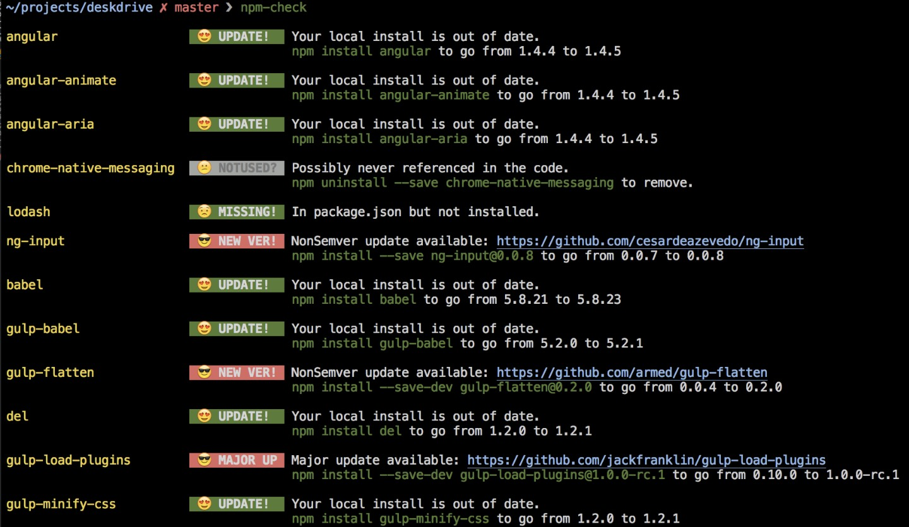

- `npm-check -u` 进入交互终端
就可以看到 版本信息：`Patch Update`、`Minor Update`、`Major Update`

关于版本号 可以阅读 👉[这里](http://localhost:8080/coffee/%E5%89%8D%E7%AB%AF/%E8%AF%AD%E4%B9%89%E5%8C%96%E7%9A%84%E7%89%88%E6%9C%AC%E5%8F%B7.html)

#### [npm-check-updates](https://www.npmjs.com/package/npm-check-updates)
- 全局安装  `npm install -g npm-check-updates`
- 使用  `ncu` 检查

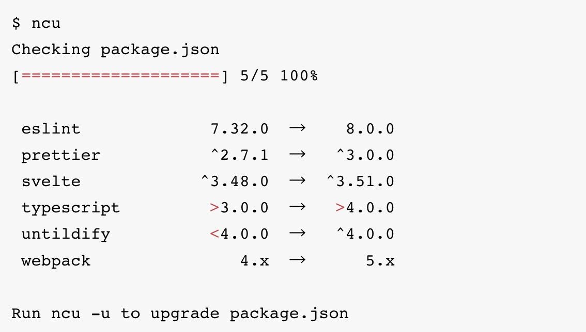

### 🐬 方案3: git 平台 bot

#### github 平台 [Dependabot](https://github.com/dependabot)
#### gitlab 平台 [renovatebot/tutorial](https://github.com/renovatebot/tutorial)
