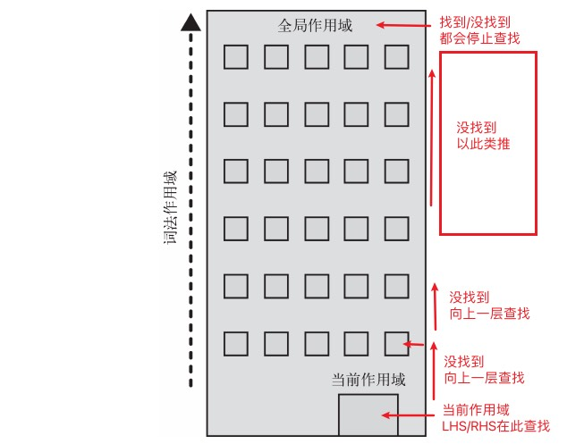

# 理解作用域

能够存储一个变量、并能对其进行读取和修改。是几乎所有编程语言的基本能力之一。

那么变量存储在哪里 程序如何正确的找到它们？这就需要设计一套规则，这个规则就是作用域。

## ⚡ 编译原理
在传统编译语言的流程中，程序中的一段源代码在执行之前会经历三个步骤，统称为“编译”

#### 分词/词法分析（Tokenizing/Lexing）

```
分词的主要任务是将文本划分为最小的语言单位，称为词语或标记（tokens）。
比如这段程序：`var a = 1`, 通常会被分解为：`"var"、"a"、"="、"1"、";"` 。
```

#### 解析/语法分析（Parsing）

```
解析是编译器中的另一个重要阶段，紧随词法分析之后。
它的主要任务是将词法分析器生成的词法单元序列转化为 "抽象语法树"（Abstract Syntax Tree，AST）
```

``` js
// `var a = 1` 的抽象语法树中可能会有一个叫作 `VariableDeclaration` 的顶级节点
- VariableDeclaration
  // 接下来是一个叫作 `Identifier`（它的值是 a）的子节点
  - Identifier (a)
  // 以及一个叫作 `AssignmentExpression`的子节点。
  - AssignmentExpression
    // 节点有一个叫作 `NumericLiteral`（它的值是 `1`）的子节点。
    - NumericLiteral (1) AssignmentExpression`
```

#### 代码生成
```
将 `AST`转 换为可执行代码的过程, 这个过程与语言、目标平台等息息相关。
可以将 `var a = 2;` 的 `AST` 转化为一组机器指令，用来创建一个叫作 `a` 的变量，并将一个值储存在 `a` 中。
```

::: tip Tips：关于分词（tokenizing）和词法分析（Lexing）之间的微妙区别

分词：
- 分词在编译过程中通常指的是将源代码中的字符序列划分成标记，即最小的语言单位。
- 在编译器中，词法分析的一部分就是分词。分词后的标记作为词法分析的输出，成为后续编译阶段的输入之一。
- 分词过程通常是无状态的，它主要关注如何将字符序列拆分成独立的标记。

词法分析：
- 在编译中，词法分析是编译器的第一个阶段，也称为扫描器（Scanner）或词法分析器（Lexer）。
- 任务是将源代码分解成词法单元，例如关键字、标识符、常数等。这些词法单元是编程语言中的基本构建块。
- 词法分析器通常是有状态的，因为它需要考虑标记之间的语法结构，以正确地识别各种词法单元。

例如上面的 `var a = 1` 词法分析的输出是一个词法单元序列:

 `[(关键字, "var"), (标识符, "a"), (运算符, "="), (常数, 1), (分号, ";")]`。
:::


## ⚡ 作用域理解
- 引擎 (从头到尾负责整个 JavaScript 程序的编译及执行过程)
- 编译器 (负责语法分析及代码生成等)
- 作用域 (负责收集并维护由所有声明的标识符组成的一系列查询, 确定当前执行的代码对这些标识符的访问权限。)

#### 分解 `var a = 1`
```
当发生 `var a = 1` 编辑器会做如下处理：
(1) var a
    编辑器 询问 作用域：在当前域中 是否已经有一个 a 的变量？
      - 是：忽略声明 继续编译；
      - 否：要求 作用域 在当前域声明 a；
(2) a = 1
    编辑器为引擎生成代码 处理 a = 1
    引擎 询问 作用域：在当前域中 是否有一个 a 的变量？
      - 是：引擎找到a 并赋值为 1
      - 否: 引擎继续查找 a (如果没找到会抛出一个异常)
```

::: info 总结
变量的赋值操作会执行两个动作，首先编译器会在当前作用域中声明一个变量（之前没有声明过），
然后在运行时引擎会在作用域中查找该变量，如果能够找到就会对它赋值。
a = 1 会查询（LHS 查询）变量 a 并对其进行赋值
:::

#### ⚡ LHS查询、RHS查询

在上文的 第（2）步 `a = 1` 中 引擎会为变量 a 进行 LHS 查询。

- LHS（赋值操作的目标是谁：如果你想给某个变量赋值，就会进行 LHS 查询。）
- RHS (谁是赋值操作的源头：如果你想获取某个变量的值，就会进行 RHS 查询。)

``` js
// 声明变量 x，这是一个 LHS 查询
let x;
 // 对变量 x 进行赋值操作，也是一个 LHS 查询
x = 10;
// 赋值语句右侧的表达式 x 是一个 RHS 查询，因为它是为了获取变量 x 的值。
// 然后，这个值被赋给变量 y，这是一个 LHS 查询。
let y = x;
// 调用 fun 函数 是一个 RHS 查询
// 然后，传入了一个 1 给函数的参数 这里有个 隐式的 a＝1 是 LHS
fun(1)
```

::: warning 注意：
其实 RHS 并不是真正意义上的“赋值操作的右侧”，更准确地说是“非左侧”。
比如  console.log(a) 其中对 a 的 引用是一个 RHS 引用。
千万不要忘记函数传递参数如 fun(1) 中隐式的 LHS 查询哦！
:::

::: info Tips: 为什么要区分 LHS RHS？
因为它能帮助我们正确地识别 JavaScript 程序运行中抛出的异常类型。
其中属 TypeError、ReferenceError 最为常见并且十分重要，而这两个异常类型却和 LHS、RHS 有着千丝万缕的联系。
继续阅读下文中《关于异常》
:::

## ⚡ 作用域嵌套

#### 作用域的嵌套
- 当一个块或函数嵌套在另一个块或函数中时，就发生了作用域的嵌套 如：
``` js
// 继续使用上文中的 var a = 1
var a = 1;
// 定义一个 fun
function fun(b) {
  // 在当前作用域中对 a 进行 RHS 引用 无法完成
  // 但可以在上一级作用域中完成
  console.log(a + b);
}
fun(2);
```

#### 作用域链


::: info 总结
引擎从当前的执行作用域开始查找变量，如果找不到，就向上一级继续查找。
当抵达最外层的全局作用域时，无论找到还是没找到，查找过程都会停止。
:::

## ⚡ 关于异常

- RHS 查询在所有嵌套的作用域中无法找到目标变量，引擎就会抛出 ReferenceError异常。
- RHS 如果找到目标变量 但你对该变量进行不合法的操作，会抛出另一种异常，TypeError。
- LHS 查询在所有嵌套的作用域中无法找到目标变量，便会自动创建该变量给引擎（非 严格模式）。
- LHS 查询在所有嵌套的作用域中无法找到目标变量，严格模式下同 RHS 会抛出 ReferenceError异常。

::: info Tips:
ES5 中引入了“严格模式”，其中的一个行为就是 禁止自动或隐式地创建全局变量
:::